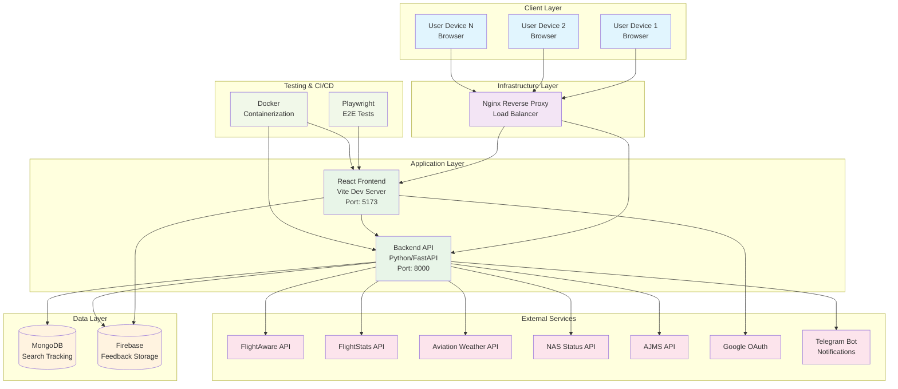
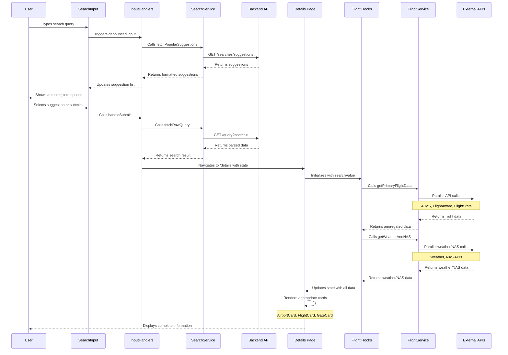

# Cirrostrats Frontend Architecture

## System-Level Architecture

This diagram shows the high-level system components, external services, and data flow.

## Product-Level Architecture

This diagram shows the internal React application structure, components, and their relationships.

```mermaid
graph TB
    subgraph "App Layer"
        APP[App.jsx<br/>• Google OAuth Provider<br/>• React Router<br/>• Main Layout]
    end
    
    subgraph "Pages Layer"
        HOME[Home.jsx<br/>• Search Interface<br/>• User Authentication<br/>• Feedback System]
        DETAILS[Details.jsx<br/>• Data Orchestration<br/>• Multi-type Display<br/>• Error Handling]
        STORY[Story.jsx<br/>• Company Information]
        CONTACT[Contact.jsx<br/>• Contact Form]
        SOURCE[Source.jsx<br/>• Data Sources Info]
        SEARCHES[Searches.jsx<br/>• Search History]
        LIVEMAP[LiveMap.jsx<br/>• Live Map View]
        ANALYTICS[SearchAnalyticsDashboard.jsx<br/>• Analytics Display]
    end
    
    subgraph "Component Layer"
        subgraph "Input System"
            SEARCHINPUT[SearchInput.jsx<br/>• Autocomplete<br/>• Debounced Input]
            INPUTHOOKS[Input Hooks<br/>• useInputHandlers<br/>• useSuggestions<br/>• useDebounce<br/>• useTrackSearch]
            SEARCHSERVICE[searchService.js<br/>• API Calls<br/>• Query Processing]
        end
        
        subgraph "Display Components"
            AIRPORTCARD[AirportCard.jsx<br/>• Weather Display<br/>• NAS Information]
            FLIGHTCARD[FlightCard.jsx<br/>• Flight Details<br/>• Route Information]
            GATECARD[GateCard.jsx<br/>• Gate Information<br/>• Departure Data]
            WEATHERINFO[WeatherInfo.jsx<br/>• METAR/TAF<br/>• D-ATIS]
            NASDETAILS[NASDetails.jsx<br/>• NAS Status]
        end
        
        subgraph "UI Components"
            NAVBAR[Navbar.jsx<br/>• Navigation<br/>• Hamburger Menu]
            UTCTIME[UTCTime.jsx<br/>• UTC Clock]
            SKELETON[Skeleton.jsx<br/>• Loading States]
            FEEDBACK[FeedbackPopup.jsx<br/>• User Feedback]
        end
    end
    
    subgraph "Data Layer"
        subgraph "Custom Hooks"
            AIRPORTDATA[useAirportData<br/>• Weather Fetching<br/>• NAS Data]
            GATEDATA[useGateData<br/>• Gate Information<br/>• Departure Data]
            FLIGHTDATA[useFlightData<br/>• Multi-source Aggregation<br/>• Data Validation]
        end
        
        subgraph "Services"
            FLIGHTSERVICE[flightService.js<br/>• External API Integration<br/>• Data Processing<br/>• Error Handling]
            FIREBASE[firebase.js<br/>• Firebase Configuration<br/>• Firestore Connection]
        end
    end
    
    subgraph "External APIs"
        BACKENDAPI[Backend API<br/>• /query<br/>• /searches/suggestions<br/>• /ajms<br/>• /flightAware<br/>• /flightStatsTZ]
        FIREBASEAPI[Firebase API<br/>• Feedback Storage<br/>• User Data]
    end
    
    %% App to Pages
    APP --> HOME
    APP --> DETAILS
    APP --> STORY
    APP --> CONTACT
    APP --> SOURCE
    APP --> SEARCHES
    APP --> LIVEMAP
    APP --> ANALYTICS
    
    %% Pages to Components
    HOME --> SEARCHINPUT
    HOME --> NAVBAR
    HOME --> UTCTIME
    HOME --> FEEDBACK
    
    DETAILS --> AIRPORTCARD
    DETAILS --> FLIGHTCARD
    DETAILS --> GATECARD
    DETAILS --> WEATHERINFO
    DETAILS --> NASDETAILS
    DETAILS --> SKELETON
    DETAILS --> FEEDBACK
    
    %% Input System Flow
    SEARCHINPUT --> INPUTHOOKS
    INPUTHOOKS --> SEARCHSERVICE
    SEARCHSERVICE --> BACKENDAPI
    
    %% Data Flow
    DETAILS --> AIRPORTDATA
    DETAILS --> GATEDATA
    DETAILS --> FLIGHTDATA
    
    AIRPORTDATA --> FLIGHTSERVICE
    GATEDATA --> FLIGHTSERVICE
    FLIGHTDATA --> FLIGHTSERVICE
    
    FLIGHTSERVICE --> BACKENDAPI
    
    %% Feedback Flow
    FEEDBACK --> FIREBASE
    FIREBASE --> FIREBASEAPI
    
    %% Styling
    classDef app fill:#e3f2fd
    classDef pages fill:#e8f5e8
    classDef components fill:#fff3e0
    classDef data fill:#f3e5f5
    classDef external fill:#fce4ec
    
    class APP app
    class HOME,DETAILS,STORY,CONTACT,SOURCE,SEARCHES,LIVEMAP,ANALYTICS pages
    class SEARCHINPUT,INPUTHOOKS,SEARCHSERVICE,AIRPORTCARD,FLIGHTCARD,GATECARD,WEATHERINFO,NASDETAILS,NAVBAR,UTCTIME,SKELETON,FEEDBACK components
    class AIRPORTDATA,GATEDATA,FLIGHTDATA,FLIGHTSERVICE,FIREBASE data
    class BACKENDAPI,FIREBASEAPI external
```

## Component Interaction Flow

This diagram shows the detailed interaction flow for the search and data display process.

## Technology Stack

### Frontend Technologies
- **React 18.2.0** - UI Framework
- **Vite 5.1.4** - Build Tool & Dev Server
- **React Router DOM 6.22.2** - Client-side Routing
- **Material-UI 5.15.15** - UI Component Library
- **Axios 1.6.7** - HTTP Client
- **Firebase 12.0.0** - Backend Services
- **Google OAuth** - Authentication

### Development & Testing
- **Playwright 1.54.1** - End-to-End Testing
- **ESLint** - Code Linting
- **Docker** - Containerization
- **Node.js 21.7.1** - Runtime Environment

### External Integrations
- **FlightAware API** - Flight tracking data
- **FlightStats API** - Flight information
- **Aviation Weather API** - Weather data
- **NAS Status API** - Airspace information
- **AJMS API** - Flight management data
- **Telegram Bot** - Notification system

## Key Architectural Patterns

1. **Component-Based Architecture** - Modular React components with clear separation of concerns
2. **Custom Hooks Pattern** - Reusable logic for data fetching and state management
3. **Service Layer Pattern** - Centralized API communication and data processing
4. **Lazy Loading** - Performance optimization through code splitting
5. **Error Boundary Pattern** - Graceful error handling and user feedback
6. **Container/Presentational Pattern** - Separation of logic and presentation components

